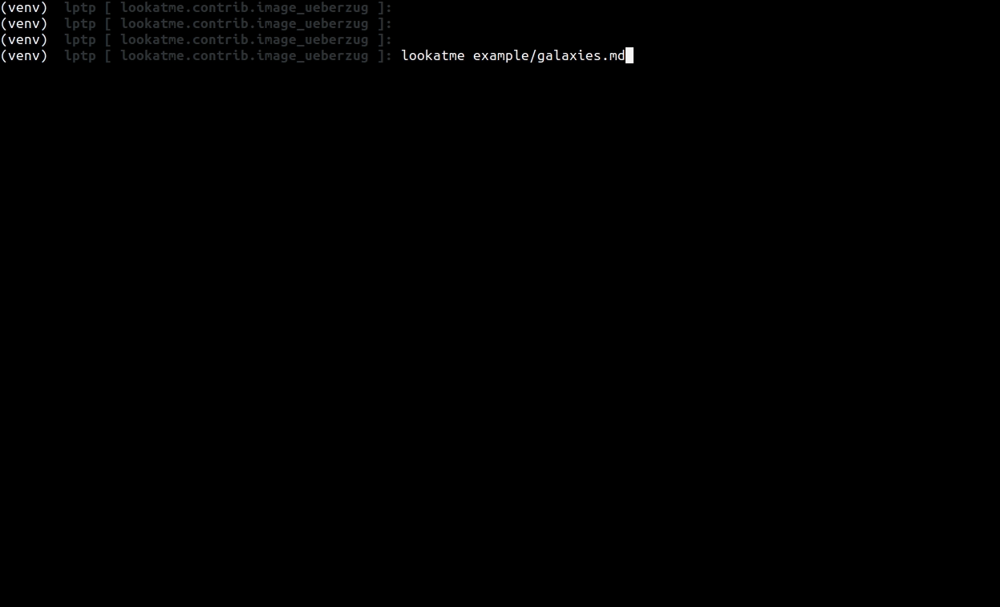

# lookatme.contrib.image_ueberzug

This is a [lookatme](https://github.com/d0c-s4vage/lookatme) extension that
uses [ueberzug](https://github.com/seebye/ueberzug) and
[urwid-ueberzogen](https://github.com/seebye/urwid-ueberzogen/tree/master/urwid_ueberzogen)
to provide image rendering support. This works on linux only (or wherever
ueberzug functions).


After successfully installing, you should see something like this:



## Installation

```bash
pip install lookatme.contrib.image_ueberzug
```

## Usage

Use images! For now, only local images are supported. Remote image support
will be added later.
